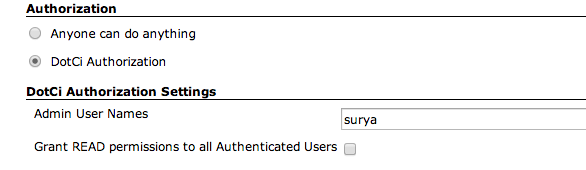

##DotCi - Jenkins github integration, .ci.yml.
Brings ease of build configuration of cloud ci systems like travisci and ease of runtime environment configuration of docker to jenkins.

 **+**  **+** 
***
 - [Features](#features)
 - [Installation](docs/Installation.md)
 - [Usage](docs/Usage.md)
 - [Extending DotCi](docs/Extending.md)
 - [Developer Setup](docs/DevelopmentSetup.md)
 - [License](#license)

###Features
***
 * **Github Integration** (both github.com and GHE)
    - Automatically sets up Github webhooks for pull requests and github pushes when a new job is setup.
    - Sets [commit status](https://github.com/blog/1227-commit-status-api) during and after build run.
      

    - Jobs follow name-spacing structure of github, jobs are nested under organization folder
      allowing for multiple jobs with same name under different org.
      

 * Job **authorization** mapped to corresponding github repo permissions.

   

 * **Job Enhancements**
    - Build Changeset from github payload.
    - Builds on master branch get special treatment
        * LastBuild permalink points to last build for master.
        * Master tab in buildhistory widget

         
        *  `lastSuccessfulMaster` permalink.

    - Fetch builds by git sha (`job/meow/sha?value=<sha>`)
    - Fetch last build for a branch (`job/meow?branch=<branch-name>`)


* **Scaling Jenkins**.
   * Backed by a mongodb database.
   * Store unlimited number of builds without performance degradation.
   * Query build statistics by querying database.

* **User builds view** (This is the default view in our jenkins installation)

  

* **Build setup through .ci.yml**

  Two supported build types
     * [Docker Build](docs/DockerBuild.md)
     * [Install_Packages Build](docs/InstallPackages.md)


###Setup
   See:  [Installation](docs/Installation.md)
###Usage
   See: [Usage](docs/Usage.md)
###Extending DotCi
 See: [Extending DotCi](docs/Extending.md)
###Developer Setup
  See: [Developer Setup](docs/DevelopmentSetup.md)

###License
```
The MIT License (MIT)

Copyright (c) 2014, Groupon, Inc.

Permission is hereby granted, free of charge, to any person obtaining a copy
of this software and associated documentation files (the "Software"), to deal
in the Software without restriction, including without limitation the rights
to use, copy, modify, merge, publish, distribute, sublicense, and/or sell
copies of the Software, and to permit persons to whom the Software is
furnished to do so, subject to the following conditions:

The above copyright notice and this permission notice shall be included in
all copies or substantial portions of the Software.

THE SOFTWARE IS PROVIDED "AS IS", WITHOUT WARRANTY OF ANY KIND, EXPRESS OR
IMPLIED, INCLUDING BUT NOT LIMITED TO THE WARRANTIES OF MERCHANTABILITY,
FITNESS FOR A PARTICULAR PURPOSE AND NONINFRINGEMENT. IN NO EVENT SHALL THE
AUTHORS OR COPYRIGHT HOLDERS BE LIABLE FOR ANY CLAIM, DAMAGES OR OTHER
LIABILITY, WHETHER IN AN ACTION OF CONTRACT, TORT OR OTHERWISE, ARISING FROM,
OUT OF OR IN CONNECTION WITH THE SOFTWARE OR THE USE OR OTHER DEALINGS IN
THE SOFTWARE.
```
