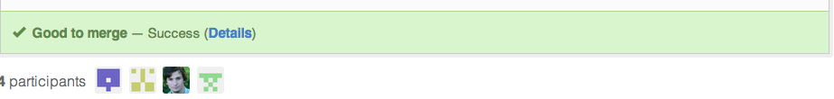
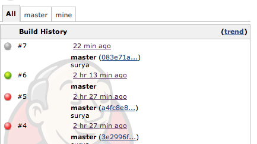

##DotCi - Jenkins github integration, .ci.yml.
  **+**  **+**  
***
 - [Features](#features)
 - [Usage](docs/Usage.md)
 - [Setup](docs/Setup.md)
 - [Extending DotCi](docs/Extending.md)
 - [License](#license)

###Features
***
 * **Github Integration** (both github.com and GHE) 
    - Automatically sets up Github webhooks for pull requests and github pushes when a new job is setup.
    - Sets [commit status](https://github.com/blog/1227-commit-status-api) during and after build run.
       
      
    - Projects are name-spaced under organization which allows creation of multiple projects with same names under different organizations.

 * **Build configuration through .ci.yml**  
    * Speed up builds by running builds in parallel.
    * Configure build environment (language/version/dbs etc).
    * Branch/pusher specific build customization through groovy templating.
    * Plugin configuration. 
    * Notification configuration.
    * Skip Builds based on sha/branch/pusher/pull request etc.
    

 * **Docker Support**
    * Having a Dockerfile in the repo will build an image and run tests against the image.
    * Or specify a docker image to run build against in .ci.yml
    
 * **Defaults** for each language type (eg: ``mvn install`` for java), language is auto detected.    

 * **Backed by a mongodb database**. 
   * No need to purge builds to improve startup time/performance.
   * Query build statistics by querying database.
 * **Build shortcuts for deploy/command line tools**
   * Fetch builds by git sha (`job/meow/23/sha?value=<sha>`) 
   * Or branch specific permalinks (`lastSuccessfulMaster`) .
 
 * **Extensible**
   * Add new types of notifications/plugins supported in .ci.yml by writing plugins for DotCi. 
 
 * **UI enhancements**
   * Organization View
     
     
   * User builds view (This is the default view in our jenkins installation)
   
     
   * Build history by branch
     
     

###License

The MIT License (MIT)

Copyright (c) 2014, Groupon, Inc.

Permission is hereby granted, free of charge, to any person obtaining a copy
of this software and associated documentation files (the "Software"), to deal
in the Software without restriction, including without limitation the rights
to use, copy, modify, merge, publish, distribute, sublicense, and/or sell
copies of the Software, and to permit persons to whom the Software is
furnished to do so, subject to the following conditions:

The above copyright notice and this permission notice shall be included in
all copies or substantial portions of the Software.

THE SOFTWARE IS PROVIDED "AS IS", WITHOUT WARRANTY OF ANY KIND, EXPRESS OR
IMPLIED, INCLUDING BUT NOT LIMITED TO THE WARRANTIES OF MERCHANTABILITY,
FITNESS FOR A PARTICULAR PURPOSE AND NONINFRINGEMENT. IN NO EVENT SHALL THE
AUTHORS OR COPYRIGHT HOLDERS BE LIABLE FOR ANY CLAIM, DAMAGES OR OTHER
LIABILITY, WHETHER IN AN ACTION OF CONTRACT, TORT OR OTHERWISE, ARISING FROM,
OUT OF OR IN CONNECTION WITH THE SOFTWARE OR THE USE OR OTHER DEALINGS IN
THE SOFTWARE.
