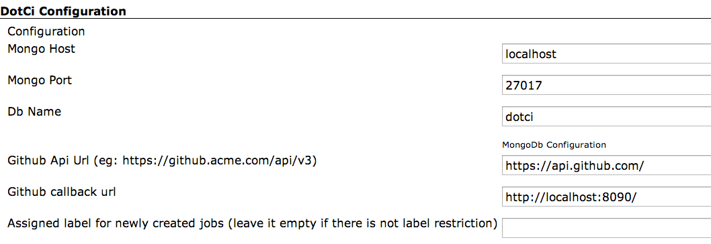

**Installation Steps**
 1. [Install Plugin](#install-plugin)
 2. [Mongodb setup](#mongodb-setup)
 3. [Github oauth plugin configuration](#github-oauth-plugin-setup)
 4. [DotCi plugin configuration](#dotci-plugin-configuration)
 5. [Configure package management](#configure-package-management)

## Install Plugin
  - Install DotCi plugin from the update center. This should also install [github-oauth-plugin](https://wiki.jenkins-ci.org/display/JENKINS/Github+OAuth+Plugin)

## Mongodb setup
   Install [mongodb](https://www.mongodb.org/) accessible to your Jenkins instance.

## Github oauth plugin configuration
   * Register an OAuth [application](https://github.com/settings/applications/new) with github to obtain Client-ID/Secret.

   * Go to `Manage Jenkins` > `Configure Global Security`
     Under `Security Realm` select `Github Authentication Plugin` and fill out required oauth credentials.


## DotCi plugin configuration
  Got to `Manage Jenkins`> `Configure System` and fill out required information under DotCi Configuration



####Private Repository configuration
Setting this up would use `repo` github oauth scope when users login.


## Configure package management

There are two options for installing packages that the build needs,

- **Docker** - Install docker on jenkins slaves where builds would run.
- **Non-Docker** - DotCi calls a bash function 'install_packages' with requested packages and languages specified in the enviroment
section of .ci.yml. It is upto you to provide implementation of this shell function available to jenkins slave running dotci build.

 Here is an example of of install_packages function using rvm for ruby builds
  ```bash
    # A .ci.yml with the following declaration
      environment:
         language: ruby
         language_version: 1.9.3
      would call install_packages ruby-1.9.3
    function install_packages(){
      gemset=`echo ${PWD##*/} | tr ',' '_'`
      set +e
      if [[ $1 =~ "ree" ]]; then
        rvm use `echo $1 | sed -e "s/^ruby-//g" -e "s/_/-/g"`@$gemset --create
      elif [[ $1 =~ "jruby" ]]; then
        rvm use `echo $1 | sed -e "s/^ruby-//g" -e "s/_/-/g"`@$gemset --create
      else
        rvm use `echo $1 | sed -e "s/_/-/g"`@$gemset --create
      fi
      rvm gemset empty --force
      set -e
    }
  ```
