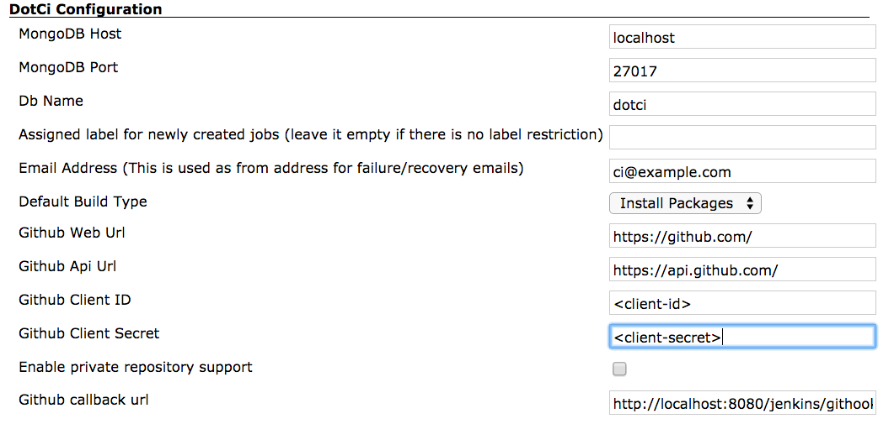

# Configure Master

1. Goto `Manage Jenkins` > `Configure Plugins` and install `DotCi`
   plugin.
2. Goto `Manage Jenkins` > `Configure System` and fill out required information under DotCi Configuration:

   
