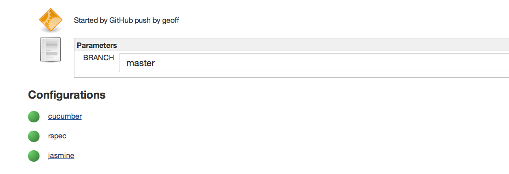

- [.ci.yml reference](#ciyml-reference)
   - [Environment Section](#environment-section)
   - [Build Section](#build-section)
   - [Notifications Section](#notifications-section)
   - [Plugins Section](#plugins-section)
- [.ci.yml examples](#ciyml-examples)

## .ci.yml reference

Build automatically inherits .ci.yml based on language that is autodetected.

Check in a .ci.yml with **overrides** for overriding the defaults.

.ci.yml file is divided into four major sections

#### Environment Section
```yaml
 environment:
    vars: #These vars are exported in shell before build starts
       BUNDLE_WITHOUT: production:development  

     language: ruby     # always single value

     language_versions:  # single value or list of values (extra row in build matrix)
     - ree-1.8.7
     - mri-1.8.7

     packages: #extra arguments that passed into install_packages call
      - memcached-1.4.5
```

#### Build Section

```groovy
build:
  skip: true #skips build
  before: # single command or list of commands (run serially on each matrix job)
  - gem install -y rubygems-update
  - update_rubygems

  info: #print machine/environment diagnostics
  - bundle --version

  # single command or list of commands (run serially on each matrix job)
  #run: rake test
  # or as a hash map (each entry run in parallel in build matrix)
  run:
    unit:        bundle exec rake spec:units
    integration: bundle exec rake spec:integration
    acceptance:  # Each parallelized step can also have multiple serial commands
    - bundle exec rake cucumber
    - bundle exec rake cucumber:javascript

  #starts a new build - initializes environment and  runs this script
  after: cap deploy staging
```
#### Notifications Section
```groovy
notifications: #list of notifications, notified ONLY on build fail and branch recovery.
  - email: #as always it can be single value or a list
     - kittah@gmail.com
     - kitty@gmail.com
  - hipchat: room-name      # single or list of roomids  
  - campfire: Devops
```

#### Plugins Section
```groovy
plugins:
  - test_output:
     format: tap |junit
  - artifacts: blah.txt # this needs to be ant file specifier format ( see  http://ant.apache.org/manual/Types/fileset.html)
  # configure your project's Build Environment: "Delete workspace before build starts" to avoid accumulative artifacts
  - checkstyle #expects file to be target/checkstyle-result.xml
  - cobertura #expects target/site/cobertura/coverage.xml
  - findbugs #expects target/findbugsXml.xml
```
##.ci.yml examples


###Parallelization
```groovy
build:
  run:
    unit: rake spec
    integration: rake integration
```

###Build Environment Configuration

#### Ruby build parallelized across two language versions
```groovy
  environment:
     language: ruby
     language_versions:
          - 1.8.7
          - 1.9.3
```

## Build templating

```groovy
 build:
    run: rake spec
    #run integration tests only on production branch
    <% if(DOTCI_BRANCH == 'production'){ %>
    after: rake integration
    <%} %>
 notifications:
   <% if(DOTCI_BRANCH == 'master') %>
```

## Plugin Configuration
 ```goovy
  plugins:
    <% if( DOTCI_BRANCH == 'master'){ %>
    - artifacts: 'packages/**/*.war'
    <%}%>
    - checkstyle
    - webhook:
        url: http://example.com/hook
        params:
          branch: ${DOTCI_BRANCH}
 ```

##Build skipping
 ```groovy
   build:
     #only build master
     <% if( DOTCI_BRANCH != 'master') %>
 ```
