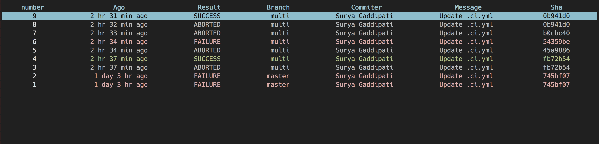

### Cli guide
## Installation

```yaml
  npm install -g dotci
```
## User Guide

```yaml
  dotci -s http://localhost:8080/jenkins --repo suryagaddipati/DotCi ##repo defaults to current if not specified
```

## Build History
   
## Console View
   
