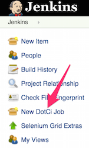
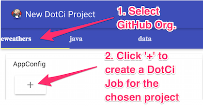
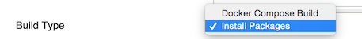

# Create new DotCi Job

**(1)** Click the `New DotCi Job` button on the Jenkins side-panel:

  

**(2)** Select the tab for your project's Github Organization and click the `+` button for the project. This will install the Webhook into your Github project's settings:

  

**(3)** (optional) Override the default build type on the per-job Configuration page:

  

**(4)** (optional) Add build tags on the per-job Configuration page (none by default):

  
