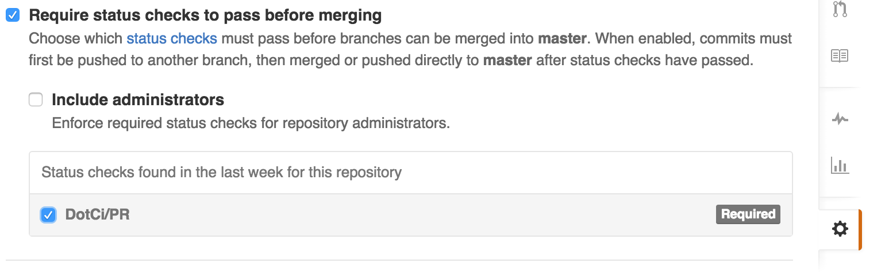

## .ci.yml Example

```yaml

   before: "git submodule init" #optional
   run: 
     unit: 
     integration: "rake integration"
   plugins: 
      - CheckStylePublisher:   
          pattern: 'checkstyle/*.xml'
```

## Protect a branch to ensure all commits go through CI before getting into master. 
   

## Protect a branch to ensure all commits go through Pull Request Process.
   
